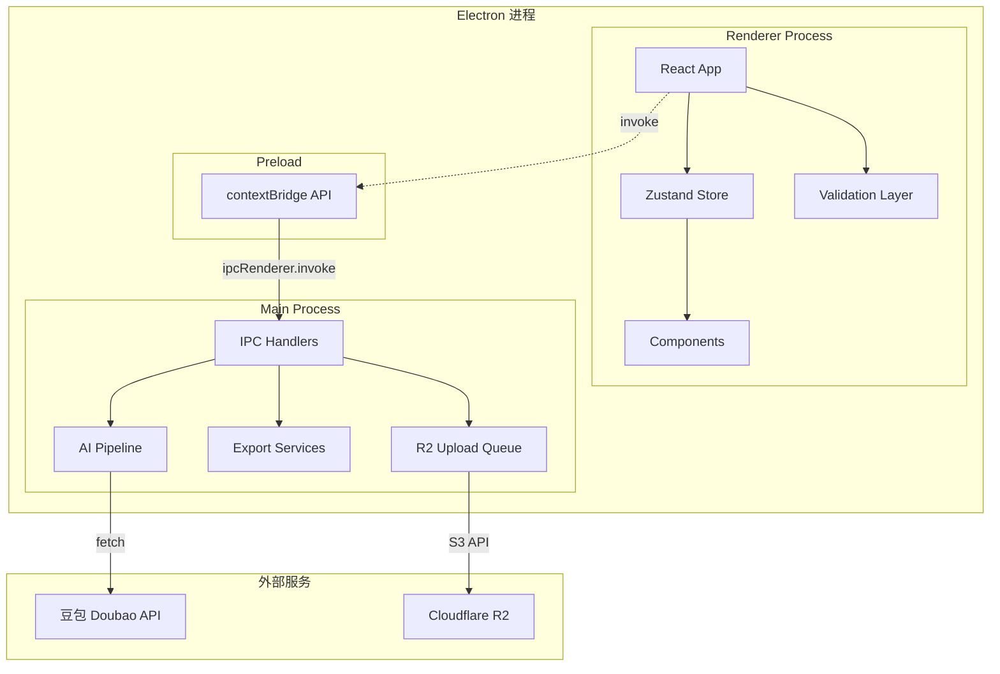

# 雨图饰品素材分拣系统 V4 — 技术架构白皮书

> **版本**: 4.0.0-beta.1  
> **文档日期**: 2026-05-24  
> **目标读者**: 后续开发者、AI IDE、对接系统 (PIM/ERP/Playwright)

---

## 目录

1. [系统概述](#1-系统概述)
2. [技术栈](#2-技术栈)
3. [整体架构](#3-整体架构)
4. [项目目录结构](#4-项目目录结构)
5. [路径别名体系](#5-路径别名体系)
6. [进程架构](#6-进程架构)
7. [IPC 通信规范](#7-ipc-通信规范)
8. [状态管理](#8-状态管理)
9. [共享类型体系](#9-共享类型体系)
10. [AI 基础设施层](#10-ai-基础设施层)
11. [素材包导出体系](#11-素材包导出体系)
12. [R2 云端同步体系](#12-r2-云端同步体系)
13. [Asset Manifest 双路径系统](#13-asset-manifest-双路径系统)
14. [数据校验系统](#14-数据校验系统)
15. [配置与安全](#15-配置与安全)
16. [product.json V4 Schema](#16-productjson-v4-schema)
17. [版本迁移](#17-版本迁移)
18. [Release 构建](#18-release-构建)
19. [当前能力与后续规划](#19-当前能力与后续规划)

---

## 1. 系统概述

「雨图饰品素材分拣系统」是一款 Electron 桌面工具，帮助跨境电商运营人员将本地产品图片按照规范分类整理，通过 AI 智能识别 + 手动标注生成标准素材包，并自动同步至 Cloudflare R2 云存储。

### 核心能力

| 模块 | 说明 |
|------|------|
| 图片扫描 | 递归读取文件夹 + Sharp 缩略图生成 (200x200 JPEG) |
| 多标签标注 | 主图/SKU图/详情图/尺寸图/证书 可选多个标签 |
| AI 智能填表 | 豆包 Doubao 视觉模型自动识别产品标题/类目/SKU名称 |
| AI 英文生成 | Shopee 英文标题/描述/材质/SKU英文名 |
| SKU 编码 | 自动生成类目-风格-序号格式编码 |
| 素材包导出 | 文件夹 + product.json v4 结构 |
| R2 云端同步 | 自动上传队列 + 并发5x + retry 3次 |
| 发布前校验 | Shopee/SKU/图片 error/warning 分级 |
| 版本迁移 | v1/v2/v3 → v4 自动补全 |

---

## 2. 技术栈

| 层级 | 技术 | 版本 |
|------|------|------|
| 桌面壳 | Electron | 33.4 |
| 构建工具 | electron-vite | 2.3 |
| 前端框架 | React | 18.3 |
| 语言 | TypeScript | 5.5 |
| 状态管理 | Zustand + Immer | 5.0 |
| 样式 | Tailwind CSS | 3.4 |
| 图片处理 | sharp | 0.33 |
| AI 模型 | 豆包 Doubao | seed-1-6-flash |
| 云存储 | Cloudflare R2 (S3 API) | - |
| 数据库(可选) | PostgreSQL | - |
| 打包 | electron-builder | 25.0 |

---

## 3. 整体架构



---

## 4. 项目目录结构

```
素材分拣/
├── src/
│   ├── shared/                      # 前后端共享
│   │   ├── constants.ts             # 全项目常量收敛
│   │   ├── migration.ts             # product.json 版本迁移 (v1-v4)
│   │   ├── types/                   # 类型定义 (模块化)
│   │   │   ├── index.ts             # 统一导出
│   │   │   ├── image.ts             # ImageLabel, ImageFile
│   │   │   ├── product.ts           # ProductInfo, ProductOutput, IPC
│   │   │   ├── sku.ts               # SkuItem, SpuData, PackagingPreset
│   │   │   ├── shopee.ts            # ShopeeInfo (v4)
│   │   │   ├── r2.ts                # R2Config, UploadTask, R2Metadata
│   │   │   ├── assets.ts            # AssetFile, ProductAssets (v4)
│   │   │   └── pim.ts               # PimExtension (v4)
│   │   └── validation/              # 发布前校验
│   │       ├── types.ts             # ValidationLevel/Issue/Result/Context
│   │       ├── rules/
│   │       │   ├── shopeeRules.ts   # 标题/描述/材质
│   │       │   ├── skuRules.ts      # 名称/售价/库存
│   │       │   └── imageRules.ts    # 主图/SKU图
│   │       └── index.ts             # validateProduct()
│   │
│   ├── main/                        # Electron 主进程
│   │   ├── index.ts                 # 入口: BrowserWindow + IPC 注册
│   │   ├── db.ts                    # PostgreSQL 连接池
│   │   ├── ipc/                     # IPC Handler 层 (薄层, 委托 service)
│   │   │   ├── selectDirectory.ts
│   │   │   ├── scanFolder.ts
│   │   │   ├── organizeFiles.ts
│   │   │   ├── dbHandlers.ts
│   │   │   ├── r2Config.ts
│   │   │   └── uploadQueue.ts
│   │   └── services/                # 业务逻辑层
│   │       ├── ai/                  # AI Pipeline
│   │       │   ├── index.ts         # generateShopeeEnglish()
│   │       │   ├── provider/        # doubaoProvider.ts
│   │       │   ├── prompt/          # shopeePrompt.ts
│   │       │   ├── parser/          # parseShopeeResponse.ts
│   │       │   └── utils/           # compressImage, normalizeAiError
│   │       ├── export/              # 素材包导出
│   │       │   ├── generateFolderStructure.ts
│   │       │   ├── renameImages.ts
│   │       │   ├── buildProductJson.ts
│   │       │   ├── buildAssetManifest.ts
│   │       │   ├── buildR2Metadata.ts
│   │       │   └── versioning/      # 导出版本化
│   │       │       ├── getExportVersion.ts
│   │       │       └── exportV4.ts
│   │       ├── r2/                  # R2 云端服务
│   │       │   └── versioning/
│   │       │       ├── getMetadataVersion.ts
│   │       │       └── metadataV4.ts
│   │       └── config/              # 配置系统
│   │           ├── defaultConfig.ts
│   │           ├── validateConfig.ts
│   │           └── safePath.ts
│   │
│   ├── preload/                     # Electron Preload
│   │   ├── index.ts                 # contextBridge API 定义
│   │   └── index.d.ts              # Window 类型声明
│   │
│   └── renderer/                    # React 渲染进程
│       ├── index.html
│       └── src/
│           ├── main.tsx             # React 入口
│           ├── App.tsx              # 根组件
│           ├── assets/main.css      # Tailwind + CSS变量
│           ├── store/
│           │   └── useSorterStore.ts # Zustand Store (单Store)
│           ├── hooks/
│           │   ├── useFileSystem.ts  # 双模式 (Electron/PIM)
│           │   └── useUploadQueue.ts # 上传队列状态
│           └── components/
│               ├── ProductSorter.tsx # 5步向导
│               ├── FolderPicker.tsx  # Step1
│               ├── ImageGrid.tsx     # Step2
│               ├── ImageCard.tsx     # 图片卡片
│               ├── LabelToolbar.tsx  # 标注工具栏
│               ├── ProductForm.tsx   # Step3 (编排)
│               ├── step3/sections/   # Step3 子组件
│               │   ├── BasicInfoSection.tsx
│               │   ├── ShopeeInfoSection.tsx
│               │   ├── SkuTableSection.tsx
│               │   └── PackagingSection.tsx
│               ├── PreviewPanel.tsx  # Step4
│               ├── OutputResult.tsx  # Step5
│               ├── SettingsModal.tsx # 系统设置
│               └── UploadQueueBar.tsx # 上传状态栏
│
├── electron.vite.config.ts          # Vite 构建配置 + alias
├── tsconfig.json                    # TypeScript 根配置
├── tsconfig.node.json               # Main + Preload 配置
├── tsconfig.web.json                # Renderer 配置
├── package.json                     # 4.0.0-beta.1
└── docs/
    ├── release-checklist.md
    └── V4_ARCHITECTURE.md
```

---

## 5. 路径别名体系

### tsconfig paths

```json
// tsconfig.node.json
{ "@shared/*": ["src/shared/*"] }

// tsconfig.web.json
{ "@/*": ["src/renderer/src/*"], "@shared/*": ["src/shared/*"] }
```

### Vite alias (electron.vite.config.ts)

```ts
main:     { '@shared': resolve('src/shared') }
preload:  { '@shared': resolve('src/shared') }
renderer: { '@shared': resolve('src/shared'), '@': resolve('src/renderer/src') }
```

### 使用规范

```ts
// ✓ 正确 — 跨进程引用 shared
import { TOOL_VERSION } from '@shared/constants'
import type { ProductOutput } from '@shared/types'

// ✓ 正确 — renderer 内部
import { useSorterStore } from '@/store/useSorterStore'

// ✗ 禁止 — 相对路径跨层级
import { TOOL_VERSION } from '../../../shared/constants'
```

---

## 6. 进程架构

### 6.1 Electron 主进程 (Main Process)

**职责**: 文件系统操作、AI 调用、R2 上传、IPC 处理

```ts
// BrowserWindow 安全配置
{
  webPreferences: {
    preload: join(__dirname, '../preload/index.js'),
    sandbox: false,          // Sharp/PG 原生模块需要
    contextIsolation: true,  // 渲染进程隔离
    nodeIntegration: false,  // 不暴露 Node API
  }
}
```

**关键模块**:
- `ipc/` — IPC Handler 层，薄入口，委托 `services/`
- `services/ai/` — AI Pipeline (provider→prompt→parser)
- `services/export/` — 素材包导出 (versioning→builder→serializer)
- `services/r2/` — R2 云端 metadata (versioning→builder)
- `services/config/` — 配置管理 (模板→校验→安全路径)

### 6.2 Preload

```ts
contextBridge.exposeInMainWorld('electronAPI', {
  selectDirectory, scanFolder, organizeFiles,
  openPath, readFileBase64,
  getAiConfig, saveAiConfig,
  callAiVision, callSingleSkuVision, callShopeeEnglish,
  r2ConfigGet, r2ConfigSet, r2ConfigTest,
  uploadQueueAdd, uploadQueueRetry, uploadQueueRemove,
  uploadQueueGet, uploadQueueClearCompleted,
  onUploadQueueUpdate, offUploadQueueUpdate,
})

contextBridge.exposeInMainWorld('api', {
  db: { testConnection, getPackagingPresets, ... }
})
```

### 6.3 渲染进程 (Renderer Process)

**职责**: UI 渲染、用户交互、store 状态管理

**规则**:
- 所有文件操作通过 `useFileSystem` Hook (自动选择 Electron IPC 或 PIM Agent)
- 禁止直接 import `fs` / `path`
- AI 调用通过 IPC
- R2 操作通过 IPC

---

## 7. IPC 通信规范

### 7.1 通道清单

| Channel | 方向 | 参数 | 返回 |
|---------|------|------|------|
| `select-directory` | invoke | - | `string \| null` |
| `scan-folder` | invoke | `folderPath` | `ScanFolderResult` |
| `organize-files` | invoke | `OrganizeRequest` | `OrganizeResult` |
| `open-path` | invoke | `dirPath` | `string` |
| `read-file-base64` | invoke | `filePath` | `string` |
| `get-ai-config` | invoke | - | `AiProviderConfig` |
| `save-ai-config` | invoke | `AiProviderConfig` | `void` |
| `call-ai-vision` | invoke | `CallAiVisionPayload` | `CallAiVisionResult` |
| `call-single-sku-vision` | invoke | `CallSingleSkuPayload` | `{ specName }` |
| `call-shopee-english` | invoke | `CallShopeeEnglishPayload` | `CallShopeeEnglishResult` |
| `r2-config-get` | invoke | - | `R2Config` |
| `r2-config-set` | invoke | `Partial<R2Config>` | `void` |
| `r2-config-test` | invoke | - | `{ success, error }` |
| `upload-queue-add` | invoke | `UploadTask` | `{ success, error }` |
| `upload-queue-retry` | invoke | `taskId` | `void` |
| `upload-queue-remove` | invoke | `taskId` | `void` |
| `upload-queue-get` | invoke | - | `UploadQueueState` |
| `upload-queue-clear-completed` | invoke | - | `void` |
| `upload-queue-update` | send | `UploadQueueState` | - |
| `db:test-connection` | invoke | `DbConfig` | `{ success }` |
| `db:get-packaging-presets` | invoke | - | `PackagingPreset[]` |
| `db:save-packaging-preset` | invoke | preset | `PackagingPreset` |
| `db:get-next-sku-seq` | invoke | prefix | `string` |
| `db:save-spu-and-skus` | invoke | spu+skus | `{ success }` |

### 7.2 设计原则

1. 全部使用 `ipcMain.handle` / `ipcRenderer.invoke` (异步 request-response)
2. 唯一 push 通道: `upload-queue-update` (主→渲染)
3. 所有通道全 typed (preload/index.d.ts)
4. 无 `any` 类型暴露

---

## 8. 状态管理

### 8.1 Store 结构

```ts
interface SorterStore {
  // 步骤
  currentStep: 'folder' | 'labeling' | 'info' | 'preview' | 'done'
  
  // 目录
  sourceFolderPath: string
  outputFolderPath: string   // localStorage 持久化
  
  // 图片
  images: ImageFile[]
  
  // 产品信息
  productInfo: ProductInfo
  shortTitle: string
  productCode: string
  
  // SKU
  skuList: SkuItem[]
  currentSpu: SpuData | null
  
  // v4 Shopee
  shopeeInfo: ShopeeInfo
  
  // AI 配置
  aiConfig: { apiKey, baseUrl, model }  // localStorage 持久化
  
  // 纸箱预设
  packagingPresets: PackagingPreset[]
  
  // Actions
  setAllSkuPrice / setAllSkuStock / setAllSkuWeight / setAllSkuCostPrice
}
```

### 8.2 持久化策略

```ts
persist({
  name: 'material-sorter-storage',
  partialize: (state) => ({
    outputFolderPath,    // 用户偏好
    productCounter,      // 全局编号连续性
    aiConfig,            // AI 密钥
  })
})
```

---

## 9. 共享类型体系

### 9.1 模块拆分

```
types/
├── image.ts     # ImageLabel (联合类型), ImageFile
├── product.ts   # ProductInfo, ProductOutput, SkuOutput, IPC类型
├── sku.ts       # SkuItem, SpuData, PackagingPreset, DbConfig
├── shopee.ts    # ShopeeInfo, ShopeeAttributes
├── r2.ts        # R2Config, UploadTask, R2Metadata, R2ImageEntry
├── assets.ts    # AssetFile, ProductAssets
├── pim.ts       # PimExtension
└── index.ts     # 统一 re-export
```

### 9.2 导出方式

```ts
// 外部消费者
import type { ProductOutput, SkuItem, ShopeeInfo } from '@shared/types'

// shared 内部模块
import type { ImageFile } from './image'
```

---

## 10. AI 基础设施层

### 10.1 Pipeline 架构

```
generateShopeeEnglish(input)
  │
  ├─→ compressImageToBase64(path)       # Sharp 512px JPEG 65%
  ├─→ buildShopeePrompt({...})          # System + User Prompt
  ├─→ callDoubaoApi(config, messages)   # fetch + timeout 30s + retry 2x
  ├─→ parseShopeeResponse(rawContent)   # JSON extract + schema validate
  └─→ normalizeAiError(error)           # 统一错误格式
```

### 10.2 Provider 可替换性

```ts
// 新增 provider 只需实现:
function callXxxApi(config, request): Promise<{ content, usage }>

// prompt/parser 完全不感知 provider 实现
```

### 10.3 错误分类

```ts
type AiErrorType = 'ApiKeyMissing' | 'NetworkError' | 'TimeoutError' | 'ProviderError' | 'ParseError'
```

---

## 11. 素材包导出体系

### 11.1 版本化出口

```ts
buildProductJsonData(input)
  │
  ├─→ getExportVersion({ shopeeInfo })   # 决定导出版本
  ├─→ buildV4ProductJson({...})          # v4 builder
  └─→ writeProductJson(path, data)       # serializer
```

### 11.2 导出文件夹结构

```
[LSJX00031] 蓝星三角趴小熊猫_素材包/
├── product.json
├── 产品主图/
│   ├── 主_1.jpg
│   └── 主_2.jpg
├── SKU图/
│   ├── SKU_1.jpg
│   └── SKU_2.jpg
├── 详情图/
│   ├── 详情_1.jpg
│   └── 详情_2.jpg
├── 尺寸图表/     (空)
├── 产品证书/     (空)
└── 产品视频/     (空)
```

---

## 12. R2 云端同步体系

### 12.1 上传流程

```
addTask(localPackagePath)
  │
  ├─→ getAllFiles(basePath)              # 递归扫描
  ├─→ getEmptyDirs(basePath)             # 空目录
  ├─→ uploadFile() × N                   # 并发 5x
  ├─→ uploadEmptyDir() × M               # 空目录占位
  ├─→ buildR2Metadata({ uploadedPaths }) # 构建 metadata
  ├─→ enrichAssets()                     # assets[].r2Url + uploaded
  ├─→ upload product.json                # 最终 JSON
  └─→ writeBack local product.json       # 本地同步
```

### 12.2 R2 目录结构

```
products/{folderName}/
├── product.json
├── 产品主图/
│   ├── 主_1.jpg
│   └── 主_2.jpg
├── SKU图/
│   └── SKU_1.jpg
└── ...
```

### 12.3 Metadata Versioning

```ts
buildR2Metadata(input)
  │
  ├─→ getMetadataVersion()               # → 'v4'
  └─→ buildMetadataV4({...})             # 含 stockSummary/toolVersion
```

---

## 13. Asset Manifest 双路径系统

### 13.1 设计目的

```
┌──────────────────────────────────────────────┐
│  localPath (本地绝对路径)                      │
│  ├── Playwright 自动上传 (Shopee/Lazada)      │
│  ├── 文件恢复                                  │
│  └── 本地校验                                  │
├──────────────────────────────────────────────┤
│  r2Url (云端 CDN URL)                         │
│  ├── PIM 中台                                 │
│  ├── ERP 系统                                 │
│  └── CDN 分发                                 │
└──────────────────────────────────────────────┘
```

### 13.2 数据结构

```ts
interface AssetFile {
  fileName: string       // "主_1.jpg"
  relativePath: string   // "产品主图/主_1.jpg" (相对于素材包根目录)
  localPath: string      // "D:/products/[xxx]_素材包/产品主图/主_1.jpg"
  r2Url?: string         // "https://yutu.nv315.top/products/.../主_1.jpg"
  uploaded?: boolean     // 上传状态
}

interface ProductAssets {
  main: AssetFile[]
  sku: AssetFile[]
  detail: AssetFile[]
  size: AssetFile[]
  certificate: AssetFile[]
}
```

### 13.3 product.json 中的双路径

```json
{
  "assets": {
    "main": [
      { "fileName": "主_1.jpg", "localPath": "D:/...", "r2Url": "https://...", "uploaded": true }
    ],
    "sku": [ ... ],
    "detail": [ ... ]
  },
  "r2": {
    "images": {
      "main": [ { "fileName": "主_1.jpg", "url": "https://..." } ]
    }
  }
}
```

### 13.4 为什么同时保留两层

| 使用场景 | 数据源 |
|----------|--------|
| Shopee 本地上传 | `assets.main[].localPath` |
| PIM 中台展示 | `assets.main[].r2Url` (或 `r2.images.main[].url`) |
| 上传状态检查 | `assets.main[].uploaded` |
| 文件恢复 | `assets.main[].localPath` |
| 旧系统兼容 | `r2.images` |

---

## 14. 数据校验系统

### 14.1 校验架构

```
validateProduct(ValidationContext)
  │
  ├─→ validateShopeeRules(ctx)    # 标题/描述/材质
  ├─→ validateSkuRules(ctx)       # 名称/售价/库存
  └─→ validateImageRules(ctx)     # 主图/SKU图
       │
       └─→ ValidationResult { valid, issues[] }
```

### 14.2 Error vs Warning

| 级别 | 含义 | 阻止导出 |
|------|------|---------|
| error | 必须修复 | 是 |
| warning | 建议优化 | 否 (黄色提示) |

### 14.3 校验规则

| 规则 | 级别 | 字段 |
|------|------|------|
| Shopee 英文标题为空 | error | `shopee.title` |
| Shopee 英文标题 >120 | error | `shopee.title` |
| Shopee 英文描述为空 | error | `shopee.descriptionText` |
| 材质未填写 | warning | `shopee.attributes.material` |
| SKU 名称为空 | error | `skus[].skuName` |
| SKU 售价 ≤0 | error | `skus[].sellingPrice` |
| SKU 库存 ≤0 | error | `skus[].stock` |
| 主图 <1 | error | `images.main` |
| SKU 缺对应图 | warning | `images.sku` |

---

## 15. 配置与安全

### 15.1 配置系统

```
src/main/services/config/
├── defaultConfig.ts    # AI/R2 默认模板 (密钥为空)
├── validateConfig.ts   # validateAiConfig / validateR2Config
└── safePath.ts         # 非法字符替换 + 长路径警告 + 碰撞处理
```

### 15.2 安全设计

| 项 | 状态 |
|----|------|
| contextIsolation | ✓ true |
| nodeIntegration | ✓ false |
| API Key 存储 | ai-config.json (用户目录) |
| R2 Key 存储 | r2-config.json (用户目录) |
| 默认密钥 | 全部硬编码已移除 (Phase 6A) |
| renderer fetch | ✗ 禁止 (仅主进程) |
| preload 暴露 | 仅 typed IPC invoke |
| Git 跟踪密钥 | .gitignore + git rm --cached |

### 15.3 配置校验

```ts
validateR2Config(config)
// → { valid: false, missingKeys: ['accessKeyId', 'secretAccessKey'] }
// → { valid: true, missingKeys: [] }
```

---

## 16. product.json V4 Schema

### 16.1 完整示例

```json
{
  "title": "蓝星三角趴小熊猫",
  "productNo": "LSJX00031",
  "category": "毛绒玩具",
  "description": "蓝色星星三角形趴姿小熊猫毛绒玩具...",
  "createdAt": "2026-05-24T15:30:00.000Z",
  "toolVersion": "4.0.0-beta.1",
  "localPath": "D:\\products\\[LSJX00031] 蓝星三角趴小熊猫_素材包",
  
  "outerPackaging": {
    "length": 23, "width": 13, "height": 16, "weight": 150,
    "presetName": "7号标准3层 (23×13×16cm)"
  },

  "shopee": {
    "title": "Blue Star Triangle Panda Plush Toy Cute Cartoon Doll Gift",
    "descriptionText": "This adorable blue star-shaped panda plush...[IMAGE]",
    "attributes": {
      "brand": "No Brand",
      "origin": "China",
      "material": "Plush, PP Cotton",
      "size": "15cm"
    },
    "leadTime": 5
  },

  "skus": [
    {
      "skuCode": "TO-BK-0001",
      "skuName": "蓝星三角趴小熊猫",
      "skuNameEn": "Blue Star Panda",
      "size": "15cm",
      "weight": 45,
      "costPrice": 3.5,
      "sellingPrice": 11.00,
      "stock": 100,
      "image": "SKU_1.jpg",
      "imageUrl": "https://yutu.nv315.top/products/.../SKU图/SKU_1.jpg"
    }
  ],

  "assets": {
    "main": [
      {
        "fileName": "主_1.jpg",
        "relativePath": "产品主图/主_1.jpg",
        "localPath": "D:\\products\\[LSJX00031]...\\产品主图\\主_1.jpg",
        "r2Url": "https://yutu.nv315.top/products/.../产品主图/主_1.jpg",
        "uploaded": true
      }
    ],
    "sku": [ ... ],
    "detail": [ ... ],
    "size": [],
    "certificate": []
  },

  "r2": {
    "basePath": "products/[LSJX00031] 蓝星三角趴小熊猫_素材包/",
    "baseUrl": "https://yutu.nv315.top/products/.../",
    "syncedAt": "2026-05-24T15:31:00.000Z",
    "toolVersion": "4.0.0-beta.1",
    "stockSummary": { "totalStock": 100, "skuCount": 1 },
    "images": {
      "main": [ { "fileName": "主_1.jpg", "url": "https://..." } ],
      "sku": [ { "fileName": "SKU_1.jpg", "url": "https://..." } ],
      "detail": [ { "fileName": "详情_1.jpg", "url": "https://..." } ],
      "size": [],
      "certificate": []
    }
  },

  "pim": {
    "syncedAt": null,
    "status": "draft"
  }
}
```

### 16.2 字段版本演进

| 字段 | v1 | v2 | v3 | v4 |
|------|----|----|----|-----|
| title/productNo/category | ✓ | ✓ | ✓ | ✓ |
| outerPackaging | - | - | ✓ | ✓ |
| skus[].sellingPrice | - | - | ✓ | ✓ |
| r2 | - | - | ✓ | ✓ |
| localPath | - | - | - | ✓ |
| shopee | - | - | - | ✓ |
| assets | - | - | - | ✓ |
| skus[].stock | - | - | - | ✓ |
| skus[].skuNameEn | - | - | - | ✓ |
| pim | - | - | - | ✓ |

---

## 17. 版本迁移

### 17.1 迁移函数

```ts
// src/shared/migration.ts
migrateProductJson(rawData: Record<string, unknown>): Record<string, unknown>

// 根据 toolVersion 自动选择迁移路径:
//   toolVersion 1.x → v4
//   toolVersion 2.x → v4
//   toolVersion 3.x → v4
//   toolVersion 4.x → 确保所有可选字段存在
```

### 17.2 迁移原则

1. 纯函数, 不修改入参
2. 缺失字段补默认值
3. 不覆盖已有字段
4. 保留 r2 和 skuCode
5. 不修改旧文件内容

---

## 18. Release 构建

### 18.1 构建命令

```bash
npm run build          # electron-vite build (源码 → out/)
npx electron-builder   # electron-builder (out/ → dist/)
```

### 18.2 产出

| 文件 | 大小 |
|------|------|
| 雨图饰品素材分拣系统-4.0.0-beta.1-win.zip | ~123 MB |
| win-unpacked/ (含 app.asar + sharp native) | ~189 MB |

### 18.3 原生依赖

electron-builder 自动打包 `sharp` 和 `libvips` 原生模块。

---

## 19. 当前能力与后续规划

### 19.1 V4 已完成模块

| Phase | 模块 | 状态 |
|-------|------|------|
| 1A | @shared alias + constants + types 拆分 + migration | ✅ |
| 2A | ShopeeInfo Store + ShopeeInfoSection 骨架 + SKU 扩展 | ✅ |
| 3A | AI Pipeline (provider/prompt/parser) + Shopee 英文生成 | ✅ |
| 4A | Validation (shopee/sku/image rules) + PreviewPanel v4 | ✅ |
| 4B | Export Versioning + exportV4 + organizeFiles 接线 | ✅ |
| 5A | R2 Metadata Versioning + metadataV4 + Cloud Preview | ✅ |
| 5B | uploadQueue 日志 + 统计 + allSettled 容错 | ✅ |
| 6A | 密钥清理 + Config System + safePath + Release Checklist | ✅ |
| 6B | SKU warning 修复 + Asset 结构统一 (AssetFile/ProductAssets) | ✅ |
| RC-1 | electron-builder 打包 + Windows zip 验证 | ✅ |
| RC-2 | Asset Manifest (双路径系统) | ✅ |
| Hotfix | R2 IPC 链路修复 + uploadQueue 调试 | ✅ |

### 19.2 待开发

| 模块 | 优先级 |
|------|--------|
| Playwright 自动上传 (Shopee) | 高 |
| PIM 中台 HTTP Agent | 高 |
| PreviewPanel → organizeFiles v4 完整接线 | 中 |
| 多 provider AI (OpenAI/Gemini) | 中 |
| 加载已有素材包 (import v3 JSON) | 中 |
| NSIS 安装包 | 低 |
| 单元测试覆盖 | 低 |
| 多语言 UI | 低 |

### 19.3 外部系统对接

| 对接系统 | 数据接口 | 状态 |
|----------|---------|------|
| PIM 中台 | `r2.images` CDN URL | 就绪 |
| ERP | `product.json` (via R2) | 就绪 |
| Playwright 上传 | `assets[].localPath` | 待开发 |
| Shopee API | `shopee` 字段 | 待开发 |
