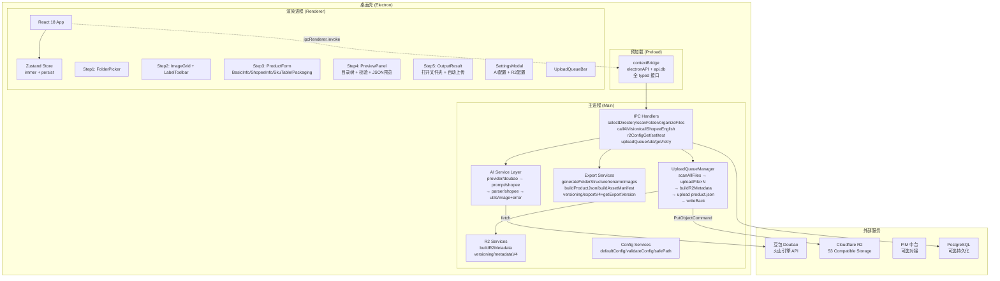

# 雨图饰品素材分拣系统 — 完整开发文档

> **版本**: v4.0.0  
> **更新日期**: 2026-05-24  
> **适用范围**: 本项目开发者、PIM 中台对接工程师、Playwright 自动化工程师

---

## 目录

1. [项目概述](#1-项目概述)
2. [快速开始](#2-快速开始)
3. [技术架构](#3-技术架构)
4. [项目结构](#4-项目结构)
5. [构建系统](#5-构建系统)
6. [Electron 进程架构](#6-electron-进程架构)
7. [IPC 通信规范](#7-ipc-通信规范)
8. [状态管理](#8-状态管理)
9. [共享类型体系](#9-共享类型体系)
10. [常量系统](#10-常量系统)
11. [用户操作流程](#11-用户操作流程)
12. [导出模块](#12-导出模块)
13. [AI 基础设施](#13-ai-基础设施)
14. [R2 云端同步](#14-r2-云端同步)
15. [数据校验系统](#15-数据校验系统)
16. [Asset Manifest 系统](#16-asset-manifest-系统)
17. [配置与安全](#17-配置与安全)
18. [版本迁移](#18-版本迁移)
19. [SKU 编码规则](#19-sku-编码规则)
20. [product.json 完整 Schema](#20-productjson-完整-schema)
21. [Release 构建与发布](#21-release-构建与发布)
22. [Git 分支规范](#22-git-分支规范)
23. [开发规范](#23-开发规范)
24. [故障排查](#24-故障排查)
25. [外部系统对接指引](#25-外部系统对接指引)
26. [术语表](#26-术语表)

---

## 1. 项目概述

### 1.1 产品定位

"雨图饰品素材分拣系统"是一款基于 Electron 的桌面工具，为跨境电商运营人员提供产品图片分类、AI 智能填表、素材包生成、R2 云端同步一站式工作流。

### 1.2 解决的问题

| 问题 | 方案 |
|------|------|
| 本地图片杂乱 | 按标签分类 (主图/SKU图/详情图/尺寸图/证书) |
| 产品信息录入慢 | AI 视觉识别自动生成标题/类目/SKU 名称 |
| 跨境英文困难 | AI 一键生成 Shopee 英文标题/描述/材质 |
| 素材包不规范 | 标准化文件夹 + product.json v4 结构 |
| 云端分发不便 | 自动上传 R2 + CDN URL 回写 |
| 发布前检查遗漏 | 预置校验规则 (error/warning 分级) |

### 1.3 两种运行模式

| 模式 | 判断条件 | 文件操作方式 |
|------|---------|-------------|
| 独立 Electron | `window.electronAPI` 存在 | IPC (ipcMain/ipcRenderer) |
| PIM 嵌入模式 | `window.electronAPI` 不存在 | HTTP Agent (localhost:18899) |

切换由 `src/renderer/src/hooks/useFileSystem.ts` 自动处理。

---

## 2. 快速开始

### 2.1 环境要求

- Node.js >= 18
- npm >= 9
- Windows 10+ (macOS/Linux 可构建但未完全测试)

### 2.2 安装与运行

```bash
# 安装依赖
npm install

# 开发模式 (Electron + Vite HMR)
npm run dev

# 生产构建 (electron-vite)
npm run build

# 打包 Windows 版本
npx electron-builder --win
```

### 2.3 首次配置

1. 启动后打开右下角设置 (齿轮图标)
2. AI 大模型标签: 填入火山引擎 API Key (从 https://console.volcengine.com/ark 获取)
3. R2 云存储标签: 填入 Cloudflare R2 Access Key + Secret
4. 点击"测试连接"确认配置正确

配置文件位置:
- 开发模式: 项目根目录 `ai-config.json` / `r2-config.json`
- 打包后: `%APPDATA%/material-sorter/`

---

## 3. 技术架构



### 3.1 架构原则

1. **进程隔离**: 主进程负责 Node.js 操作, 渲染进程仅 UI
2. **Service 分层**: IPC Handler 层薄入口, 业务逻辑在 Service 层
3. **版本化管理**: Export/R2 Metadata 均通过 versioning 层决定输出格式
4. **纯函数 Builder**: exportV4 / metadataV4 不写文件不依赖 Electron API
5. **错误归一化**: 所有外部错误统一格式, 不暴露 raw stack 到 renderer

---

## 4. 项目结构

```
素材分拣/
├── package.json                     # 项目配置 v4.0.0
├── electron.vite.config.ts          # electron-vite 构建配置 + alias
├── tsconfig.json                    # TypeScript 根配置 (project references)
├── tsconfig.node.json               # Main/Preload TS 配置
├── tsconfig.web.json                # Renderer TS 配置
├── tailwind.config.js               # Tailwind CSS 配置
├── postcss.config.js                # PostCSS 配置
├── .gitignore
│
├── src/
│   ├── shared/                      # ⚡ 前后端共享代码
│   │   ├── constants.ts             #    全项目常量 (131行)
│   │   ├── migration.ts             #    product.json 版本迁移
│   │   ├── types/                   #    类型定义 (模块化)
│   │   │   ├── index.ts             #       统一导出入口
│   │   │   ├── image.ts             #       ImageLabel, ImageFile
│   │   │   ├── product.ts           #       ProductInfo, Output, IPC
│   │   │   ├── sku.ts               #       SkuItem, SpuData
│   │   │   ├── shopee.ts            #       ShopeeInfo (v4)
│   │   │   ├── r2.ts                #       R2Config, R2Metadata
│   │   │   ├── assets.ts            #       AssetFile, ProductAssets
│   │   │   └── pim.ts               #       PimExtension
│   │   └── validation/              #    发布前校验
│   │       ├── types.ts             #       校验类型定义
│   │       ├── rules/
│   │       │   ├── imageRules.ts    #       图片规则
│   │       │   ├── shopeeRules.ts   #       Shopee 规则
│   │       │   └── skuRules.ts      #       SKU 规则
│   │       └── index.ts             #       validateProduct()
│   │
│   ├── main/                        # 🖥 Electron 主进程
│   │   ├── index.ts                 #    入口: BrowserWindow + IPC 注册
│   │   ├── db.ts                    #    PostgreSQL 连接池
│   │   ├── ipc/                     #    IPC Handler 层 (薄)
│   │   │   ├── selectDirectory.ts   #       文件夹选择
│   │   │   ├── scanFolder.ts        #       文件夹扫描 + 缩略图
│   │   │   ├── organizeFiles.ts     #       导出素材包
│   │   │   ├── dbHandlers.ts        #       数据库操作
│   │   │   ├── r2Config.ts          #       R2 配置管理
│   │   │   └── uploadQueue.ts       #       上传队列管理
│   │   └── services/                #    业务逻辑层
│   │       ├── ai/                  #       AI Pipeline
│   │       │   ├── index.ts         #         统一入口
│   │       │   ├── provider/        #         Provider 层
│   │       │   ├── prompt/          #         Prompt 层
│   │       │   ├── parser/          #         Parser 层
│   │       │   └── utils/           #         工具层
│   │       ├── export/              #       素材包导出
│   │       │   ├── generateFolderStructure.ts
│   │       │   ├── renameImages.ts
│   │       │   ├── buildProductJson.ts
│   │       │   ├── buildAssetManifest.ts
│   │       │   ├── buildR2Metadata.ts
│   │       │   └── versioning/
│   │       ├── r2/                  #       R2 云端服务
│   │       │   └── versioning/
│   │       └── config/              #       配置系统
│   │           ├── defaultConfig.ts
│   │           ├── validateConfig.ts
│   │           └── safePath.ts
│   │
│   ├── preload/                     # 🔌 Electron Preload
│   │   ├── index.ts                 #    contextBridge API
│   │   └── index.d.ts              #    Window 类型声明
│   │
│   └── renderer/                    # 🎨 React 渲染进程
│       ├── index.html
│       └── src/
│           ├── main.tsx             #    React 入口
│           ├── App.tsx              #    根组件
│           ├── assets/main.css      #    Tailwind + 设计变量
│           ├── store/               #    状态管理
│           │   └── useSorterStore.ts
│           ├── hooks/               #    自定义 Hook
│           │   ├── useFileSystem.ts
│           │   └── useUploadQueue.ts
│           └── components/          #    UI 组件
│               ├── ProductSorter.tsx     # 5步向导
│               ├── FolderPicker.tsx      # Step1
│               ├── ImageGrid.tsx         # Step2
│               ├── ImageCard.tsx         # 图片卡片
│               ├── LabelToolbar.tsx      # 标注栏
│               ├── ProductForm.tsx       # Step3 编排
│               ├── step3/sections/       # Step3 子组件
│               │   ├── BasicInfoSection.tsx
│               │   ├── ShopeeInfoSection.tsx
│               │   ├── SkuTableSection.tsx
│               │   └── PackagingSection.tsx
│               ├── PreviewPanel.tsx      # Step4
│               ├── OutputResult.tsx      # Step5
│               ├── SettingsModal.tsx     # 设置
│               └── UploadQueueBar.tsx    # 上传状态栏
│
├── docs/
│   ├── V4_ARCHITECTURE.md           # 技术架构白皮书
│   ├── release-checklist.md         # 发布检查清单
│   └── 开发文档.md                   # 本文档
│
├── dist/                            # electron-builder 输出
├── out/                             # electron-vite 输出
└── resources/                       # 构建资源
```

---

## 5. 构建系统

### 5.1 electron-vite 配置

```typescript
// electron.vite.config.ts
export default defineConfig({
  main: {
    resolve: { alias: { '@shared': resolve('src/shared') } },
    plugins: [externalizeDepsPlugin()],
    build: {
      rollupOptions: { external: ['sharp', 'pg'] }  // 原生模块不打包
    }
  },
  preload: {
    resolve: { alias: { '@shared': resolve('src/shared') } },
    plugins: [externalizeDepsPlugin()]
  },
  renderer: {
    resolve: {
      alias: {
        '@': resolve('src/renderer/src'),
        '@shared': resolve('src/shared')
      }
    },
    plugins: [react()]
  }
})
```

### 5.2 路径别名

| Alias | 解析路径 | 使用场景 |
|-------|---------|---------|
| `@shared/*` | `src/shared/*` | 所有三个进程 |
| `@/*` | `src/renderer/src/*` | 仅 Renderer |

### 5.3 TypeScript 配置层级

```
tsconfig.json (根, project references)
  ├── tsconfig.node.json (main + preload + shared)
  │     compilerOptions: { baseUrl, paths: { "@shared/*" } }
  │     include: [src/main/**, src/preload/**, src/shared/**]
  └── tsconfig.web.json (renderer + shared)
        compilerOptions: { baseUrl, paths: { "@/*", "@shared/*" } }
        include: [src/renderer/src/**, src/preload/*.d.ts, src/shared/**]
```

---

## 6. Electron 进程架构

### 6.1 BrowserWindow 配置

```typescript
new BrowserWindow({
  width: 1280,
  height: 800,
  minWidth: 1000,
  minHeight: 600,
  title: '雨图饰品素材分拣系统',
  backgroundColor: '#f8f9fa',
  show: false,
  webPreferences: {
    preload: join(__dirname, '../preload/index.js'),
    sandbox: false,           // sharp/pg 原生模块需要
    contextIsolation: true,   // 渲染进程完全隔离
    nodeIntegration: false,   // 不暴露 Node API 到渲染进程
  }
})
```

### 6.2 安全边界

| 层 | 能力 | 限制 |
|----|------|------|
| Renderer | React UI, Zustand Store, IPC invoke | 不能 import fs/path/process, 不能直接 fetch |
| Preload | contextBridge, 类型转发 | 仅 typed invoke, 不执行业务逻辑 |
| Main | 完整 Node.js + Electron API | 无 UI 渲染 |

---

## 7. IPC 通信规范

### 7.1 通道完整清单

| Channel | 类型 | Payload | 返回值 |
|---------|------|---------|--------|
| `select-directory` | invoke | - | `string \| null` |
| `scan-folder` | invoke | `string` (folderPath) | `ScanFolderResult` |
| `organize-files` | invoke | `OrganizeRequest` | `OrganizeResult` |
| `open-path` | invoke | `string` | `string` |
| `read-file-base64` | invoke | `string` | `string` |
| `get-ai-config` | invoke | - | `AiProviderConfig` |
| `save-ai-config` | invoke | `AiProviderConfig` | `void` |
| `call-ai-vision` | invoke | `CallAiVisionPayload` | `CallAiVisionResult` |
| `call-single-sku-vision` | invoke | `{ base64Data, aiConfig? }` | `{ success, specName? }` |
| `call-shopee-english` | invoke | `CallShopeeEnglishPayload` | `CallShopeeEnglishResult` |
| `r2-config-get` | invoke | - | `R2Config` |
| `r2-config-set` | invoke | `Partial<R2Config>` | `void` |
| `r2-config-test` | invoke | - | `{ success, error? }` |
| `upload-queue-add` | invoke | `UploadTask` | `{ success, error? }` |
| `upload-queue-retry` | invoke | `string` (taskId) | `void` |
| `upload-queue-remove` | invoke | `string` (taskId) | `void` |
| `upload-queue-get` | invoke | - | `UploadQueueState` |
| `upload-queue-clear-completed` | invoke | - | `void` |
| `upload-queue-update` | **send** | `UploadQueueState` | - (push) |
| `db:test-connection` | invoke | `DbConfig` | `{ success, error? }` |
| `db:get-packaging-presets` | invoke | - | `{ success, data? }` |
| `db:save-packaging-preset` | invoke | preset | `{ success, data? }` |
| `db:get-next-sku-seq` | invoke | `string` (prefix) | `{ success, data? }` |
| `db:save-spu-and-skus` | invoke | `SpuData + SkuItem[]` | `{ success, error? }` |

### 7.2 设计原则

- 全部使用 `ipcMain.handle` / `ipcRenderer.invoke` → 异步 request-response
- 唯一 push 通道: `upload-queue-update` (主进程 → 渲染进程)
- 所有 payload 和返回值在 `preload/index.d.ts` 中声明类型
- 禁止 `any` 类型流经 IPC 边界

### 7.3 典型调用链

```
Renderer                     Preload                    Main
  │                            │                         │
  ├─ window.electronAPI        │                         │
  │   .callShopeeEnglish({})   │                         │
  │                            │                         │
  └──────────────────→ ipcRenderer.invoke                │
                       ('call-shopee-english', {...})    │
                               │                         │
                               └────────────→ ipcMain.handle
                                                     │
                                                     ├── generateShopeeEnglish()
                                                     │   ├── compressImageToBase64()
                                                     │   ├── buildShopeePrompt()
                                                     │   ├── callDoubaoApi()  → 火山引擎
                                                     │   └── parseShopeeResponse()
                                                     │
                                                     └── return { success, data }
                               ←─────────────────────────
                       ipcRenderer.invoke resolves
  ←────────────────────
  result.data → 更新 Store
```

---

## 8. 状态管理

### 8.1 Store 架构

```typescript
// Zustand + Immer + persist
export const useSorterStore = create<SorterStore>()(
  persist(
    immer((set) => ({ /* state + actions */ })),
    {
      name: 'material-sorter-storage',
      storage: createJSONStorage(() => localStorage),
      partialize: (state) => ({
        outputFolderPath,    // 用户偏好
        productCounter,      // 全局计数器
        aiConfig,            // AI 配置 (含 apiKey)
      }),
    }
  )
)
```

### 8.2 主要状态

| 分类 | 状态 | 说明 |
|------|------|------|
| 步骤 | `currentStep` | 'folder' \| 'labeling' \| 'info' \| 'preview' \| 'done' |
| 目录 | `sourceFolderPath` / `outputFolderPath` | 输入/输出目录 |
| 图片 | `images: ImageFile[]` | 含缩略图 base64 + 多标签 |
| 标注 | `activeLabel` / `selectedImageIds` | 当前标注类型/选中图片 |
| 产品 | `productInfo` / `shortTitle` / `productCode` | 产品基础信息 |
| SKU | `skuList` / `currentSpu` | SKU 列表 + SPU 数据 |
| Shopee | `shopeeInfo` (v4) | 英文标题/描述/属性/备货时间 |
| AI | `aiConfig` | apiKey/baseUrl/model |
| 上传 | 通过 `useUploadQueue` Hook | 订阅 push events |

### 8.3 v4 新增批量操作

```typescript
setAllSkuPrice(price)     // 批量设置售价
setAllSkuStock(stock)     // 批量设置库存
setAllSkuWeight(weight)   // 批量设置重量
setAllSkuCostPrice(cost)  // 批量设置成本价
```

---

## 9. 共享类型体系

### 9.1 文件与职责

| 文件 | 导出类型 | 说明 |
|------|---------|------|
| `image.ts` | `ImageLabel`, `ImageFile` | 6种标签联合类型 |
| `product.ts` | `ProductInfo`, `ProductOutput`, `SkuOutput`, `OrganizeRequest/Result` | 产品 + IPC |
| `sku.ts` | `SkuItem`, `SpuData`, `PackagingPreset`, `DbConfig` | SKU + SPU + DB |
| `shopee.ts` | `ShopeeInfo`, `ShopeeAttributes` | v4 Shopee 发布 |
| `r2.ts` | `R2Config`, `UploadTask`, `R2Metadata` | 云存储 |
| `assets.ts` | `AssetFile`, `ProductAssets` | 本地素材清单 |
| `pim.ts` | `PimExtension` | PIM 对接预留 |

### 9.2 使用方式

```typescript
// 外部消费者 (main/preload/renderer)
import type { ProductOutput, ShopeeInfo } from '@shared/types'

// shared 内部模块
import type { ImageFile } from './image'
```

---

## 10. 常量系统

所有业务常量集中在 `src/shared/constants.ts`，禁止在代码中硬编码。

### 10.1 关键常量

```typescript
TOOL_VERSION = '4.0.0'           // product.json toolVersion 字段

LABEL_TO_FOLDER                  // '主图' → '产品主图'
PACKAGE_SUB_FOLDERS              // 6个导出子目录
PACKAGE_SUFFIX = '_素材包'

FOLDER_TO_R2_CATEGORY           // '详情图' → 'detail'

CATEGORY_CODE_MAP                // '包包挂件' → 'BG'
STYLE_CODE_MAP                   // '白色系' → 'WT'
STYLE_KEYWORD_MAP                // '白' → 'WT'

DEFAULT_AI_CONFIG                // apiKey: '' (空, 用户填写)
DEFAULT_SHOPEE_VALUES            // brand: 'No Brand', origin: 'China'

IMAGE_EXTENSIONS                 // ['.jpg', '.jpeg', '.png', ...]
MIME_TYPE_MAP                    // '.jpg' → 'image/jpeg'

UPLOAD_CONCURRENCY = 5           // R2 并发上传数
UPLOAD_MAX_RETRIES = 3           // 最大重试次数
UPLOAD_RETRY_DELAY_MS = 2000     // 重试间隔

IMAGE_COMPRESSION                // 512px, JPEG 65%
THUMBNAIL_SIZE                   // 200px, JPEG 75%
```

---

## 11. 用户操作流程

### 11.1 五步向导

```
Step 1                    Step 2                    Step 3
┌──────────────┐        ┌──────────────┐        ┌──────────────┐
│  选择文件夹    │  ───→  │  图片标注      │  ───→  │  产品信息      │
│              │        │              │        │              │
│ 源文件夹选择   │        │ 多标签标注     │        │ 中文标题/类目 │
│ 输出目录选择   │        │ SKU 规格设置   │        │ AI 智能填表   │
│ 扫描生成缩略图 │        │ 批量标注       │        │ Shopee 英文   │
└──────────────┘        └──────────────┘        │ SKU 表编辑    │
                                                  │ 外包装规格    │
                                                  └──────┬───────┘
                                                         │
      Step 5                    Step 4                   │
┌──────────────┐        ┌──────────────┐                │
│   完成        │  ←───  │  确认输出      │ ←──────────────┘
│              │        │              │
│ 打开文件夹    │        │ 目录树预览     │
│ 自动加入上传  │        │ 数据摘要       │
│ 下一个产品    │        │ 校验面板       │
└──────────────┘        │ product.json  │
                         └──────────────┘
```

### 11.2 每步产出

| 步骤 | 产出 | 存储位置 |
|------|------|---------|
| Step 1 | `sourceFolderPath`, `outputFolderPath` | Store + localStorage |
| Step 2 | `images: ImageFile[]` (含标签) | Store |
| Step 3 | `skuList`, `shopeeInfo`, SKU 编码 | Store |
| Step 4 | 校验结果 + 确认 | Store → 导出 |
| Step 5 | 本地素材包 + R2 上传 | 文件系统 + R2 |

---

## 12. 导出模块

### 12.1 导出架构

```
organizeFiles.ts (IPC Handler, 43行)
  │
  ├── generateFolderStructure(outputPath, no, title)
  │     → 创建素材包目录 + 6个子目录
  │
  ├── renameAndCopyImages(packagePath, images)
  │     → 按标签分组 + 复制重命名 → RenamedFile[]
  │
  ├── buildProductJsonData({ productInfo, skuList, shopeeInfo, renamedFiles })
  │     ├── getExportVersion() → 'v4'
  │     ├── buildV4ProductJson() → ProductOutput
  │     └── buildAssetManifest(renamedFiles) → ProductAssets
  │
  └── writeProductJson(packagePath, data)
        → product.json
```

### 12.2 导出目录结构

```
[{productNo}] {shortTitle}_素材包/
├── product.json              # 元数据 v4
├── 产品主图/
│   ├── 主_1.jpg
│   └── 主_2.jpg
├── SKU图/
│   ├── {规格值}_1.jpg
│   └── {规格值}_2.jpg
├── 详情图/
│   └── 详情_1.jpg
├── 尺寸图表/                  (空目录, 有内容时自动填充)
├── 产品证书/                  (空目录)
└── 产品视频/                  (空目录)
```

### 12.3 exportV4 写入的字段

```typescript
buildV4ProductJson(input) → ProductOutput {
  title, productNo, category, description,
  outerPackaging: { length, width, height, weight, presetName },
  skus: [{ skuCode, skuName, size, weight, costPrice, sellingPrice, image, stock, skuNameEn }],
  createdAt, toolVersion: '4.0.0',
  localPath,                    // ← v4 新增: 素材包绝对路径
  shopee?: ShopeeInfo,          // ← v4 新增
  assets?: ProductAssets,       // ← v4 新增
  pim: { syncedAt, status },   // ← v4 新增
}
```

---

## 13. AI 基础设施

### 13.1 Pipeline 分层

```
┌─────────────────────────────────────┐
│ generateShopeeEnglish(input)         │  ← 统一入口
├─────────────────────────────────────┤
│ prompt/shopeePrompt.ts              │  ← System + User Prompt 构建
│   buildShopeePrompt({ cnTitle, ... })│
├─────────────────────────────────────┤
│ provider/doubaoProvider.ts           │  ← API 调用层
│   callDoubaoApi(config, messages)    │  ← fetch + 30s timeout + retry 2x
├─────────────────────────────────────┤
│ parser/parseShopeeResponse.ts        │  ← 响应解析层
│   parseShopeeResponse(raw, skuCount) │  ← JSON 提取 + markdown 剥离
├─────────────────────────────────────┤
│ utils/compressImage.ts              │  ← Sharp 512px JPEG 65%
│ utils/normalizeAiError.ts           │  ← 错误归一化
└─────────────────────────────────────┘
```

### 13.2 Provider 可替换设计

```typescript
// 新增 provider 只需实现:
function callXxxApi(config: AiProviderConfig, request: AiProviderRequest): Promise<AiProviderResponse> {
  return { content, usage }
}

// prompt/parser 层完全不感知 provider
```

### 13.3 错误分类

```typescript
type AiErrorType =
  | 'ApiKeyMissing'   // 密钥未配置
  | 'NetworkError'    // 网络不通
  | 'TimeoutError'    // 30s 超时
  | 'ProviderError'   // 服务端 5xx / 429
  | 'ParseError'      // JSON 解析失败
```

### 13.4 Shopee 英文生成输入输出

**输入**: 中文标题、中文描述、类目、SKU 名称列表、主图路径(可选)

**输出**: 
```typescript
{
  title: string          // 英文标题 (Title Case, 34-180字符)
  descriptionText: string // 英文描述 (含 [IMAGE] 占位符)
  material: string       // 材质 (逗号分隔, 如 "Resin, Rope")
  skuNamesEn: string[]   // SKU 英文名 (与输入顺序一致)
}
```

---

## 14. R2 云端同步

### 14.1 上传流程

```
OutputResult.tsx (Step 5 挂载)
  │
  └── uploadQueueAdd({ localPackagePath, folderName })
        │
        ├── validateR2Config()           # 配置完整性检查
        ├── getAllFiles(packagePath)     # 递归扫描所有文件
        ├── getEmptyDirs(packagePath)    # 获取空目录 (用于占位)
        │
        ├── uploadFile() × N             # 并发 5x
        │     s3Key = products/{folder}/{relativePath}
        │     PushState → renderer 进度更新
        │
        ├── buildR2Metadata({            # 构建 R2 元数据
        │     folderName, baseUrl,
        │     uploadedPaths,
        │     originalSkus
        │   })
        │     → r2Field (含 stockSummary, toolVersion)
        │     → updatedSkus (含 imageUrl)
        │
        ├── enrichAssets()               # 回写 assets[].r2Url + uploaded
        │
        ├── upload product.json          # 最终 JSON 到 R2
        │
        └── writeBack local product.json # 本地同步
```

### 14.2 R2 目录结构

```
products/{folderName}/
├── product.json
├── 产品主图/
│   └── 主_1.jpg
├── SKU图/
│   └── SKU_1.jpg
├── 详情图/
│   └── 详情_1.jpg
├── 尺寸图表/
├── 产品证书/
└── 产品视频/
```

### 14.3 R2 Metadata v4 字段

```typescript
{
  basePath: "products/{folder}/",
  baseUrl: "https://yutu.nv315.top/products/{folder}/",
  syncedAt: "2026-05-24T...",
  images: {
    main: [{ fileName, url }],
    sku: [{ fileName, url }],
    detail: [{ fileName, url }],
    size: [],
    certificate: []
  },
  toolVersion: "4.0.0",           // ← v4 新增
  stockSummary: {                  // ← v4 新增
    totalStock: 100,
    skuCount: 2
  }
}
```

---

## 15. 数据校验系统

### 15.1 校验入口

```typescript
validateProduct(ValidationContext) → ValidationResult {
  valid: boolean
  issues: ValidationIssue[]
}
```

### 15.2 校验规则表

| 规则 | 级别 | 字段 | 说明 |
|------|------|------|------|
| Shopee 标题为空 | **error** | `shopee.title` | 必须填写 |
| Shopee 标题 > 120字符 | **error** | `shopee.title` | 超限 |
| Shopee 描述为空 | **error** | `shopee.descriptionText` | 必须填写 |
| 材质未填写 | warning | `shopee.material` | 建议填写 |
| SKU 名称为空 | **error** | `skus[].skuName` | 必须填写 |
| SKU 售价 ≤ 0 | **error** | `skus[].sellingPrice` | 必须 > 0 |
| SKU 库存 ≤ 0 | **error** | `skus[].stock` | 必须 > 0 |
| 主图 < 1 张 | **error** | `images.main` | 至少 1 张主图 |
| SKU 数量 > 图片数 | warning | `images.sku` | 部分 SKU 无图 |

### 15.3 Error vs Warning 行为

- **仅 error** 影响 `valid = false` → 阻止导出 (禁用 Step5 按钮)
- **warning** 黄色提示 → 不阻止导出
- Step 4 进入时自动执行 `validateProduct()`, 结果通过 `useMemo` 缓存

---

## 16. Asset Manifest 系统

### 16.1 设计目的

v4 系统维护**双路径资产模型**:

```
本地路径 (localPath)              云端路径 (r2Url)
─────────────────────              ─────────────────
Playwright 自动上传                 PIM 中台展示
Shopee 本地上传                     ERP 系统
文件恢复                           CDN 分发
本地校验                           外部 API 消费
```

### 16.2 数据结构

```typescript
interface AssetFile {
  fileName: string       // "主_1.jpg"
  relativePath: string   // "产品主图/主_1.jpg"
  localPath: string      // "D:/products/.../产品主图/主_1.jpg"
  r2Url?: string         // "https://yutu.nv315.top/products/.../主_1.jpg"
  uploaded?: boolean     // 上传状态标记
}

interface ProductAssets {
  main: AssetFile[]
  sku: AssetFile[]
  detail: AssetFile[]
  size: AssetFile[]
  certificate: AssetFile[]
}
```

### 16.3 生命周期

```
导出时                          上传后
─────                          ─────
buildAssetManifest(            enrich assets
  renamedFiles                   │
)                              asset.r2Url = CDN URL
  → assets[cat][i]             asset.uploaded = true
    .fileName ✓                  │
    .relativePath ✓            writeBack local
    .localPath ✓                 product.json
    .r2Url undefined
    .uploaded false
```

---

## 17. 配置与安全

### 17.1 配置系统

```
src/main/services/config/
├── defaultConfig.ts          # AI/R2 默认模板 (密钥为空)
├── validateConfig.ts         # validateAiConfig / validateR2Config
└── safePath.ts               # 非法字符替换 / 长路径警告 / 碰撞处理
```

### 17.2 配置校验

```typescript
validateR2Config({ endpoint, accessKeyId, secretAccessKey, bucket })
// → { valid: false, missingKeys: ['accessKeyId', 'secretAccessKey'] }
// → { valid: true, missingKeys: [] }
```

### 17.3 安全清单

| 项 | 状态 | 说明 |
|----|------|------|
| contextIsolation | ✓ true | 渲染进程隔离 |
| nodeIntegration | ✓ false | 不暴露 Node API |
| API Key 存储 | ai-config.json | 用户目录, .gitignore |
| R2 Key 存储 | r2-config.json | 用户目录, .gitignore |
| 代码中密钥 | ✓ 全部移除 | Phase 6A 完成 |
| preload 暴露 | 仅 typed invoke | 无 fs/process |
| renderer fetch | ✗ 禁止 | 仅 main 进程 |

### 17.4 安全路径处理

```typescript
safePath('D:\\path\\with<illegal>:chars')
// → { valid: false, sanitized: 'D:\\path\\with_illegal_chars', warnings: ['包含非法字符'] }

normalizePath('D:\\path\\to\\folder')
// → 'D:/path/to/folder'

getUniqueOutputPath('D:/products', '素材包')
// → 'D:/products/素材包_1' (如果已存在)
```

---

## 18. 版本迁移

### 18.1 迁移函数

```typescript
// src/shared/migration.ts
migrateProductJson(rawData) → upgradedData

// 根据 toolVersion 自动选择:
//   1.x → v4: 补充 r2, shopee, localPath, pim, assets, stock, skuNameEn
//   2.x → v4: 同上
//   3.x → v4: 已有 r2, 补充 shopee, localPath, pim, assets, stock
//   4.x → v4: 确保所有可选字段存在
```

### 18.2 迁移原则

1. 纯函数, 不修改入参
2. 缺失字段补默认值, 不覆盖已有字段
3. 保留 r2 和所有现有数据
4. 不修改磁盘上的旧文件

### 18.3 使用场景

- 加载已有 v3 product.json → 自动补全 v4 字段
- PIM 中台读旧数据 → migration 自动升级
- 重新导出旧素材包 → 自动生成 v4 结构

---

## 19. SKU 编码规则

### 19.1 编码格式

```
{类目编码}-{风格编码}-{4位序号}

示例:
  BG-RD-0001  (包包挂件 + 红色系 + 序号1)
  TO-BK-0002  (毛绒玩具 + 黑色系 + 序号2)
```

### 19.2 类目编码

| 类目 | 编码 |
|------|------|
| 包包挂件 | BG |
| 手机挂件 | PH |
| 车内配饰 | CR |
| 毛绒玩具 | TO |

### 19.3 风格编码 (模糊匹配)

| 风格 | 编码 | 匹配关键字 |
|------|------|-----------|
| 白色系 | WT | 白, white, 银 |
| 棕色系 | BR | 棕, 褐, 啡, 咖, brown |
| 红色系 | RD | 红, 粉, 桃, pink, red |
| 彩虹系 | RB | 彩, 虹, 花, rainbow |
| 奶油风 | CR | 奶, 米, 黄, cream |
| 黑色系 | BK | 黑, 灰, black |
| 混色/其他 | MX | 默认兜底 |

### 19.4 产品主编号

```
{拼音首字母 ≤4位}{5位计数器}

示例:
  LSJX00031  (蓝星三角趴小熊猫 → LSJX + 00031)
```

---

## 20. product.json 完整 Schema

### 20.1 v4 完整示例

```json
{
  "title": "蓝星三角趴小熊猫",
  "productNo": "LSJX00031",
  "category": "毛绒玩具",
  "description": "蓝色星星三角形趴姿小熊猫毛绒玩具...",
  "createdAt": "2026-05-24T15:30:00.000Z",
  "toolVersion": "4.0.0",
  "localPath": "D:\\products\\[LSJX00031] 蓝星三角趴小熊猫_素材包",
  
  "outerPackaging": {
    "length": 23, "width": 13, "height": 16, "weight": 150,
    "presetName": "7号标准3层 (23×13×16cm)"
  },

  "shopee": {
    "title": "Blue Star Triangle Panda Plush Toy Stuffed Animal",
    "descriptionText": "Adorable blue star panda plush...[IMAGE]...Perfect gift for all ages.",
    "attributes": {
      "brand": "No Brand",
      "origin": "China",
      "material": "Plush, PP Cotton",
      "size": "15cm"
    },
    "leadTime": 5
  },

  "skus": [
    {
      "skuCode": "TO-BK-0001",
      "skuName": "蓝星三角趴小熊猫",
      "skuNameEn": "Blue Star Panda",
      "size": "15cm",
      "weight": 45,
      "costPrice": 3.5,
      "sellingPrice": 11.00,
      "stock": 100,
      "image": "SKU_1.jpg",
      "imageUrl": "https://yutu.nv315.top/products/.../SKU图/SKU_1.jpg"
    }
  ],

  "assets": {
    "main": [{
      "fileName": "主_1.jpg",
      "relativePath": "产品主图/主_1.jpg",
      "localPath": "D:\\products\\...\\产品主图\\主_1.jpg",
      "r2Url": "https://yutu.nv315.top/products/.../产品主图/主_1.jpg",
      "uploaded": true
    }],
    "sku": [{ "...": "..." }],
    "detail": [{ "...": "..." }],
    "size": [],
    "certificate": []
  },

  "r2": {
    "basePath": "products/[LSJX00031] 蓝星三角趴小熊猫_素材包/",
    "baseUrl": "https://yutu.nv315.top/products/xxx/",
    "syncedAt": "2026-05-24T15:31:00.000Z",
    "toolVersion": "4.0.0",
    "stockSummary": { "totalStock": 100, "skuCount": 1 },
    "images": {
      "main": [{ "fileName": "主_1.jpg", "url": "https://..." }],
      "sku": [{ "fileName": "SKU_1.jpg", "url": "https://..." }],
      "detail": [{ "fileName": "详情_1.jpg", "url": "https://..." }],
      "size": [],
      "certificate": []
    }
  },

  "pim": {
    "syncedAt": null,
    "status": "draft"
  }
}
```

### 20.2 字段版本矩阵

| 字段 | v1 | v2 | v3 | v4 |
|------|----|----|----|-----|
| title/productNo/category/description | ✓ | ✓ | ✓ | ✓ |
| outerPackaging | - | - | ✓ | ✓ |
| skus (基础) | ✓ | ✓ | ✓ | ✓ |
| r2 | - | - | ✓ | ✓ |
| localPath | - | - | - | ✓ |
| shopee | - | - | - | ✓ |
| assets | - | - | - | ✓ |
| skus[].stock | - | - | - | ✓ |
| skus[].skuNameEn | - | - | - | ✓ |
| skus[].imageUrl | - | - | ✓ | ✓ |
| pim | - | - | - | ✓ |

---

## 21. Release 构建与发布

### 21.1 构建命令

```bash
# 源码构建 (TypeScript → JS)
npm run build               # electron-vite build → out/

# 应用打包
npx electron-builder --win  # → dist/*.zip

# 开发模式
npm run dev                 # electron-vite dev (HMR)
```

### 21.2 产出文件

| 文件 | 大小 | 说明 |
|------|------|------|
| `雨图饰品素材分拣系统-4.0.0-win.zip` | ~123 MB | 完整 Windows 包 |
| `win-unpacked/` | ~189 MB | 解压版 (含 app.asar + sharp) |

### 21.3 发布前检查清单

参见 `docs/release-checklist.md`

---

## 22. Git 分支规范

| 分支 | 用途 | 保护 |
|------|------|------|
| `main` | 稳定发布版本 | 仅合并 |
| `release/v3-stable` | v3 维护分支 | 仅 bugfix |
| `develop/v4` | v4 日常开发 | 活跃 |
| `feature/*` | 功能分支 | 临时 |

### Commit 规范

```
feat:     新功能
fix:      缺陷修复
refactor: 重构
perf:     性能优化
style:    样式调整
docs:     文档更新
build:    构建变更
chore:    杂项
sec:      安全相关
```

---

## 23. 开发规范

### 23.1 文件操作规则

- 文件系统操作 (`fs`, `sharp`, `path`) **仅允许** 在 `src/main/` 中
- 渲染进程通过 `useFileSystem` Hook 访问文件系统
- 禁止在 `src/renderer/` 中直接 `import 'fs'` 或 `import 'path'`

### 23.2 导入规范

```typescript
// ✓ 正确
import { TOOL_VERSION } from '@shared/constants'
import type { ProductOutput } from '@shared/types'
import { useSorterStore } from '@/store/useSorterStore'

// ✗ 禁止
import { TOOL_VERSION } from '../../../shared/constants'   // 相对路径
import fs from 'fs' in src/renderer/                       // Node API
```

### 23.3 组件规范

- Step 3 子组件放在 `components/step3/sections/`
- 组件通过 props 接收数据, 通过回调更新 store
- 禁止组件内直接 `useSorterStore.getState()` (通过 props 或顶层 Hook)

### 23.4 Service 层规范

- 业务逻辑放在 `src/main/services/`
- IPC Handler 仅做参数校验 + 调用 Service + 返回结果
- Service 函数应为纯函数或 async, 不依赖 Electron API

---

## 24. 故障排查

### 24.1 R2 测试连接无响应

```
现象: 点击"测试 R2 存储桶"没有任何反应
排查:
  1. 终端是否有 "[R2 Config] 开始测试连接"?
     - 无 → IPC 链路断开 (检查 preload/main handler)
     - 有 → 继续往下
  2. 是否有 "[R2 Config] 连接测试成功"?
     - 无 → 检查 accessKeyId/secretAccessKey 是否正确
     - 有 → 连接正常
```

### 24.2 上传队列不启动

```
现象: 导出完成但不出现上传日志
排查:
  1. "[UploadQueue] addTask config: { hasKey: ??? }"
     - hasKey: false → 密钥未保存, 打开设置填入后点击"保存配置"
     - hasKey: true → 继续
  2. "[UploadQueue] 扫描完成: X 文件 + Y 空目录 = Z"
     - Z = 0 → 素材包目录为空
     - Z > 0 → 应出现上传日志
```

### 24.3 AI 调用失败

```
现象: AI 填表/生成报错
排查:
  1. 检查 apiKey 是否填入 (设置 → AI 大模型)
  2. 终端日志: "[AI] 调用失败: ..." 查看具体原因
  3. 常见: 401 (key无效), 429 (频率限制), timeout (网络)
```

---

## 25. 外部系统对接指引

### 25.1 PIM 中台

```
数据源: product.json (via R2)

读取流程:
  1. ListObjectsV2(Bucket, Prefix: 'products/')
  2. 过滤 Key 以 '/product.json' 结尾的对象
  3. GetObject 读取完整 JSON
  4. 解析并使用:
     - shopee: 发布字段
     - r2.images: CDN 图片 URL
     - skus: 规格/价格/库存
```

### 25.2 Playwright 自动上传

```
数据源: assets[].localPath

上传流程:
  1. 读取 product.json
  2. 遍历 assets.main[].localPath → 上传到 Shopee 主图
  3. 遍历 assets.sku[].localPath → 上传到 Shopee SKU图
  4. assets.detail[].localPath → 上传到 Shopee 详情图
  5. 上传成功后标记 asset.uploaded = true
```

### 25.3 ERP 系统

```
数据源: product.json (via R2 or local)

关键字段:
  - skus[].stock: 库存
  - skus[].skuCode: SKU 编码
  - skus[].sellingPrice: 售价
  - skus[].costPrice: 成本价
  - outerPackaging: 外包装尺寸/重量
```

---

## 26. 术语表

| 术语 | 说明 |
|------|------|
| SPU | Standard Product Unit, 产品聚合 |
| SKU | Stock Keeping Unit, 规格变体 |
| R2 | Cloudflare R2 对象存储 |
| PIM | Product Information Management, 产品信息中台 |
| ERP | Enterprise Resource Planning, 企业资源计划 |
| CDN | Content Delivery Network |
| IPC | Inter-Process Communication |
| HMR | Hot Module Replacement |
| ASAR | Electron 应用打包格式 |

---

> **文档维护**: 本文档随项目代码同步更新。架构变更时请同步修改本文件。
